# 북돋움


<br/>
> <b style="color:#555555">기존 프로젝트 주소 : https://github.com/wonseokLee97/BookDodum</b>
<br/>

## Book Dodum

> #### **"종이책을 즐겨읽는 사용자를 위한 빅데이터 기반 도서 추천 및 독서 모임 서비스"<br/>**
>
> <b style="color:#555555">프로젝트 기간 : 2023.02.20 ~ 2023.04.07</b> </br>
> <b style="color:#555555">리팩토링 기간 : 2023.11.01 ~ </b>


<br/>

_북돋움은 사용자의 행동을 기반으로 **개인 맞춤형 도서 추천**을 제공하는 도서 추천 서비스 입니다. </br>


<br/>
<br/>
<br/>
<br/>

## **Stacks**

#### **Environment**

<div style='display:flex;margin-bottom:20px'>


</div>

#### **Development**

<div style='display:flex;margin-bottom:20px'>


</div>

<br/>
<br/>
<br/>
<br/>

## 주요 기능 📦

> ### 추천 기능

<div style="margin:10px 0 20px 0;display:flex">
 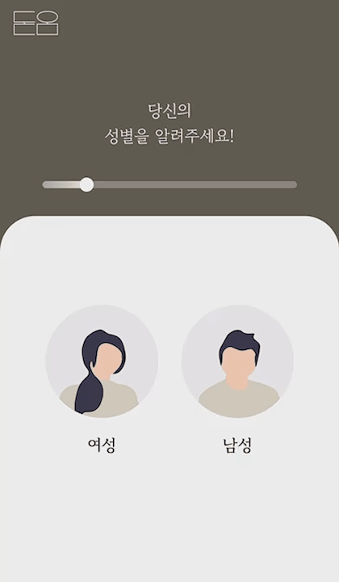
 
</div>


데이터베이스에 존재하는 책마다 미리 만들어놓은 벡터들과 자연어처리한 토큰들로 고유한 행렬을 만들고, 유저 활동을 벡터별 가중치를 만들어서 이를 이용한 추천을 진행하고 있습니다.

```
if sum(user_matrix) == 0:
    user_matrix = np.array([0.00001]*len(user_matrix))
    user_matrix = list(map(lambda x: x/sum(user_matrix),user_matrix))
    user_matrix = np.array(user_matrix)

    C = np.dot(matrix, user_matrix)
    C = list(enumerate(C))
    C = sorted(C,key=lambda x: x[1], reverse=True)[:20]

    for book_idx in range(len(user_books)):
        data = Book.objects.get(isbn=user_books[book_idx])
        user_books[book_idx] = data.id
```

<br/>

> ### 독서 모임

<div style="margin:10px 0 20px 0;display:flex">
 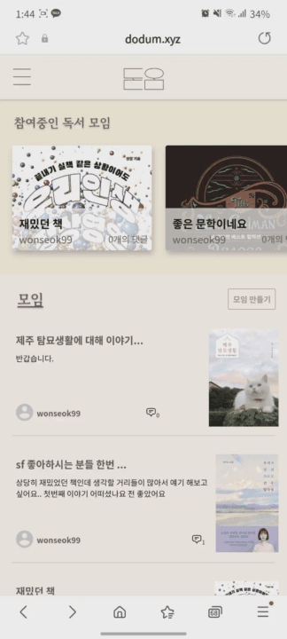
 
 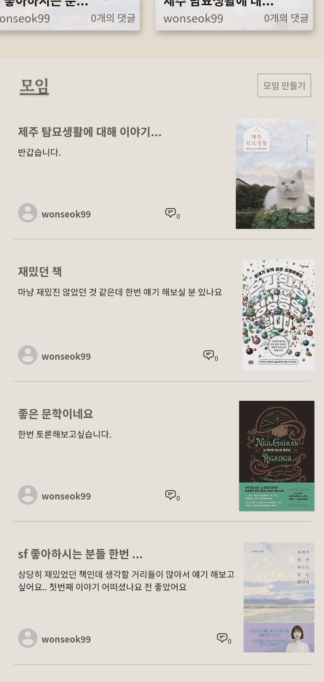
</div>

현재 읽고 있는 책을 중심으로 독서 모임을 생성하고, 생각을 나눌 수 있습니다. <br> 비공개로 설정한 모임에는 책을 읽었거나, 읽고 있는 사용자만 글을 작성할 수 있습니다.

<br/>

> ### 독후감 작성

<div style="margin:10px 0 20px 0;display:flex">
 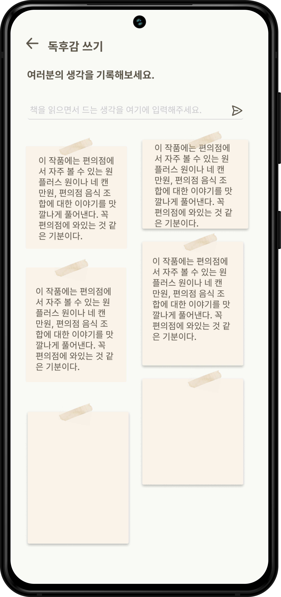
 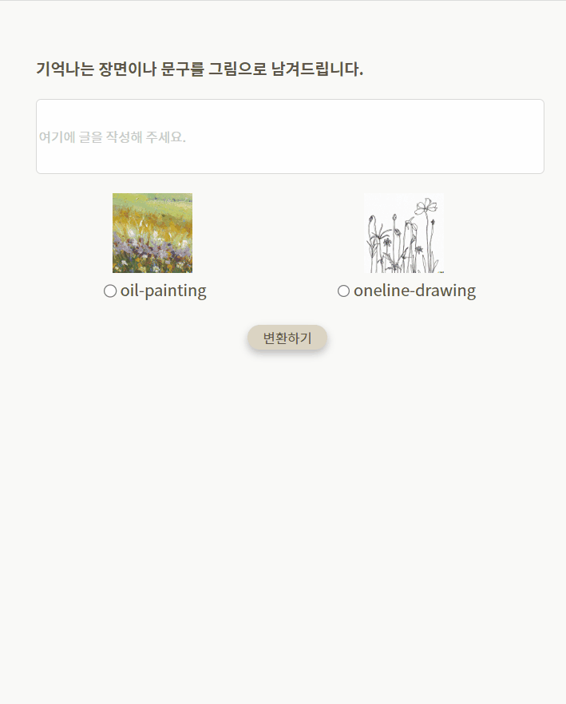
</div>

책을 읽으면서 독후감 페이지에서 독후감을 작성할 수 있습니다. <br> 책을 다 읽은 후 가장 기억에 남는 장면을 작성하면 이미지로 변환해줍니다.  

<br/>
<br/>

---

<br/>
<br/>

## 기대효과 🔔
<br/>

>### 추천

추천을 통해 책을 고르는 시간을 아낄 수 있습니다.<br> 또한 유저간에 무슨 책을 읽었는지, 다음에 무슨 책을 읽었는지 알 수 있어 다양한 분야의 책을 읽으며 식견을 넓힐 수 있습니다. 

<br/>

>### 독서모임

자신의 생각을 표현하며 한 번 더 책을 소화할 수 있습니다. <br> 이러한 생각을 사람들과 함께 공유함으로써 책 한권이 아닌 N권을 읽는 효과를 낼 수 있습니다. 

<br/>

>### 독후감작성

기록하지 않으면 기억에 잘 남지 않습니다. <br> 따라서 책을 읽을 때마다 독후감을 작성함으로써 오래 기억할 수 있게 합니다. 추가로 텍스트를 이미지로 변환해줌으로써 기억할 수 있는 효과를 극대화 해 줄 수 있습니다. 

<br/>
<br/>
<br/>
<br/>

---
## 프로젝트 파일 구조 ✔
### Backend
```
backend
├─ Django
│  ├─ books
│  │  ├─ apps.py
│  │  ├─ fixtures
│  │  ├─ migrations
│  │  ├─ models.py
│  │  ├─ serializers.py
│  │  ├─ tests.py
│  │  ├─ urls.py
│  │  └─ views.py
│  ├─ data
│  ├─ data_crawling.py
│  ├─ manage.py
│  └─new_books.json
└─ SpringFramework
  └── bookdodum
      ├── config
      ├── controller
      ├── dto
      |   ├── jwt
      │   ├── request
      │   │   ├── book
      │   │   ├── meeting
      │   │   └── user
      │   ├── resposne
      │   │   ├── api
      │   │   ├── book
      │   │   ├── meeting
      │   │   ├── review
      │   │   └── user
      │   └── user
      ├── entity
      │   ├── book
      │   ├── meeting
      │   └── user
      ├── repository
      ├── security
      │   └── common
      ├── service
      │   ├── api
      │   ├── book
      │   ├──meeting
      │   └── user
      └── util
```

### Frontend
```
frontend
├─ .env
└─ src
   ├─ apis
   ├─ App.tsx
   ├─ Assets
   ├─ Components
   │  ├─ Common
   │  └─ Contents
   ├─ pages
   │  ├─ Home
   │  ├─ ImageConvertor
   │  ├─ Intro
   │  ├─ Isbn
   │  ├─ Library
   │  ├─ Login
   │  ├─ Meeting
   │  ├─ MeetingCreate
   │  ├─ MeetingRoom
   │  ├─ Mypage
   │  ├─ ReadingBooks
   │  ├─ RecommendList
   │  ├─ Signup
   │  ├─ Survey
   │  └─ WriteText
   ├─ Store
   └─ Styles
```


<br/>
<br/>
<br/>
<br/>

## 아키텍처 설계도

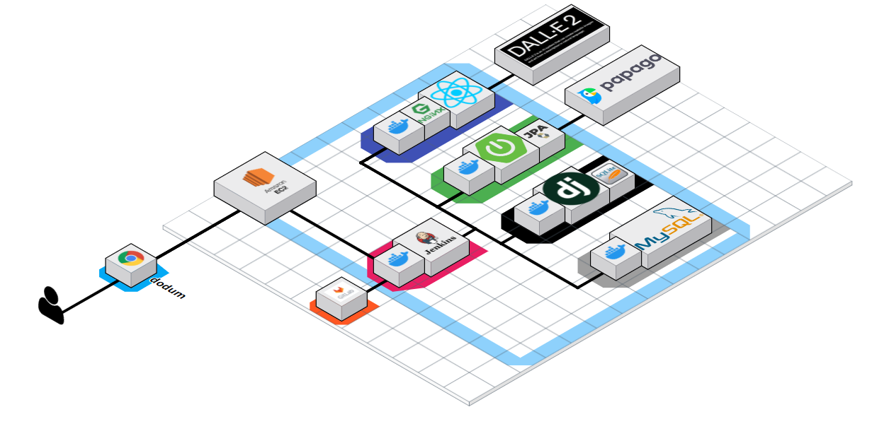

<br/>
<br/>
<br/>
<br/>

## 와이어프레임 


<br/>
<br/>
<br/>
<br/>

## 사이트맵


<br/>
<br/>
<br/>
<br/>

## 기능명세서


<br/>
<br/>
<br/>
<br/>

## ERD

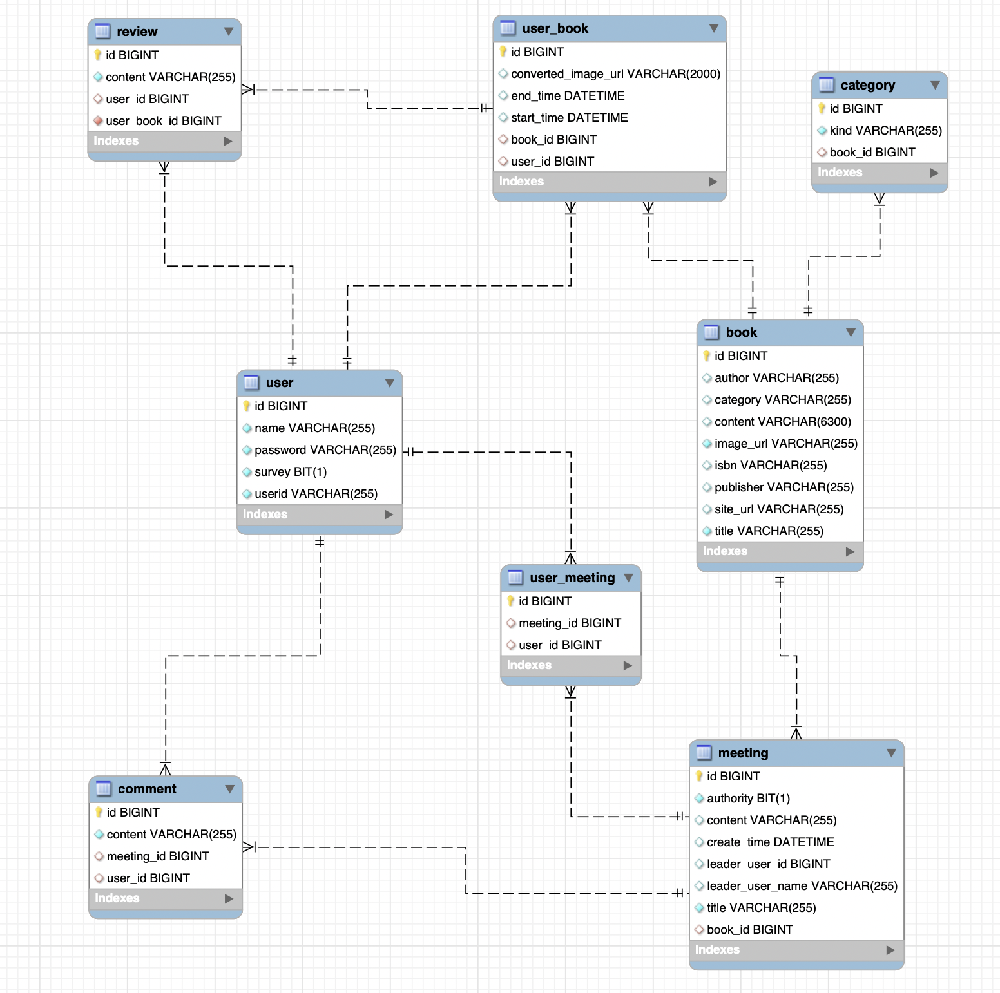

<br/>
<br/>
<br/>
<br/>

## API 명세서

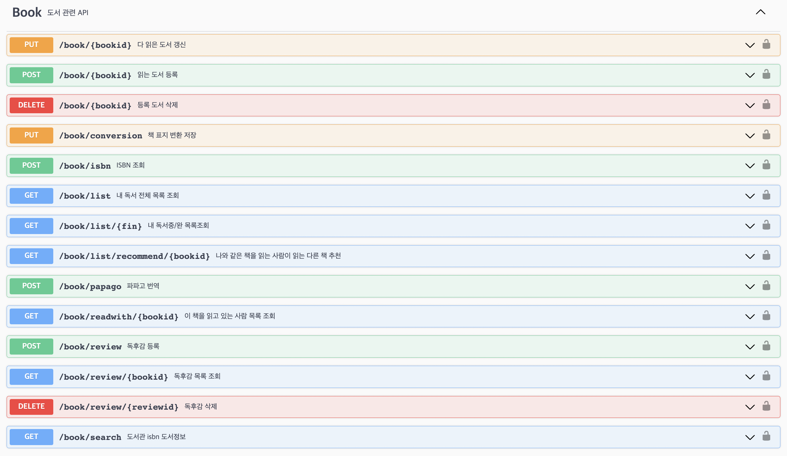
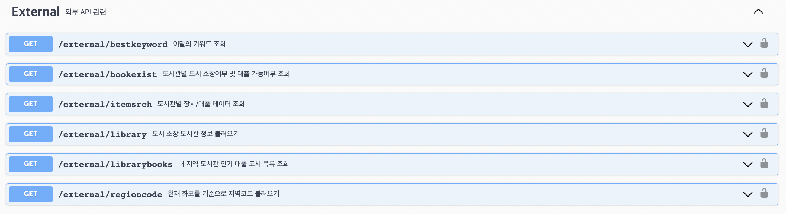
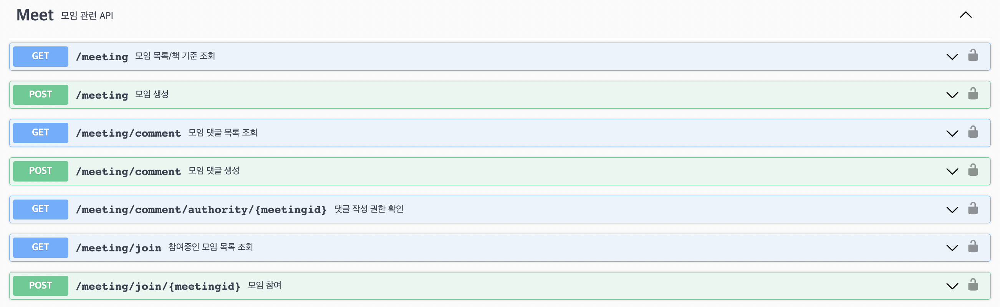
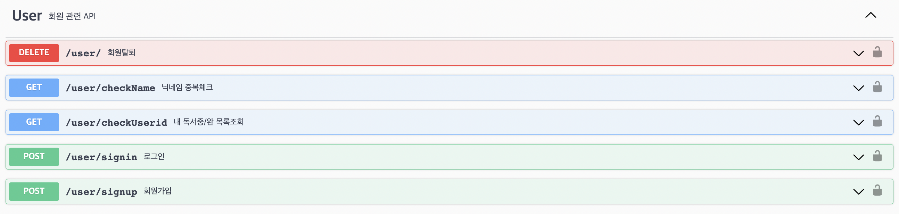

<br/>
<br/>
<br/>
<br/>

## 시스템 기술서

## 1. 프로젝트 핵심 기술
- Spring Web
- Spring Secutiry + JWT
- Spring Data JPA
- Let’s Encrypt
- Lombok
- MySQL MariaDB
- AWS (EC2)
- Jenkins

<br/>

## 2. 핵심 기술 소개

### 2-1. Spring Data JPA (+ QureyDsl)

<br/>

ORM(Object Relational Mapping) 기술을 기반하는 JPA를 활용하여 객체와 테이블을 매핑하였습니다. 추가적으로 동적 쿼리문를 통한 유연한 쿼리문을 생성하기 위해서 QueryDsl을 활용하였습니다. 또한, Pagable 을 이용하여 무한 스크롤을 구현하였습니다.

<br/>

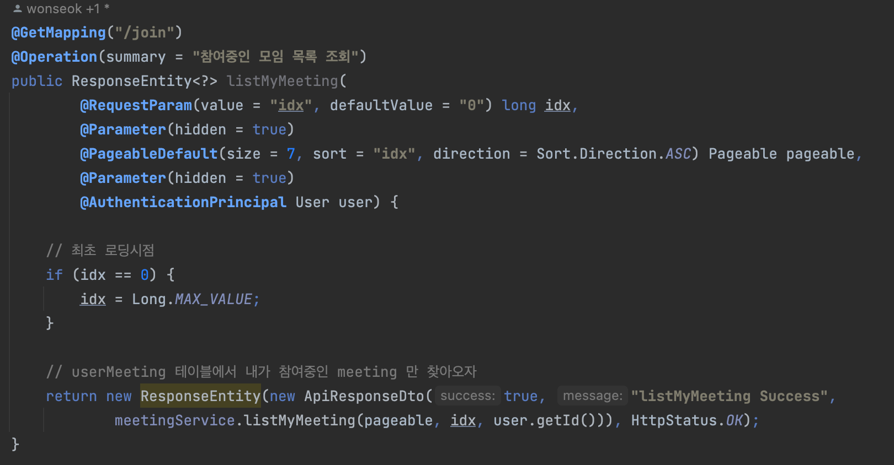
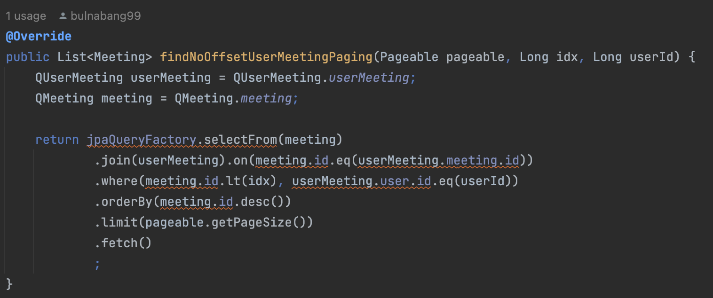

<br/>

### 2-2. Spring Security (+ JWT)

<br/>

사용자가 로그인을 하게 되면, 서버는 JWT 토큰을 생성하고 클라이언트에게 반환합니다. 클라이언트는 이 JWT 토큰을 저장하고, 서버에 요청할 때마다 헤더에 포함하여 서버에 전송합니다. 서버는 JWT 토큰을 검증하여 사용자를 인증하고, 필요한 권한을 확인하여 해당 작업을 수행합니다. 

이 JWT 토큰은 클라이언트가 자원 서버에 접근할 때 Access Token으로 사용합니다. 자원 서버는 Access Token을 검증하여 클라이언트의 권한을 확인하고, 요청을 처리할 수 있습니다.

<br/>

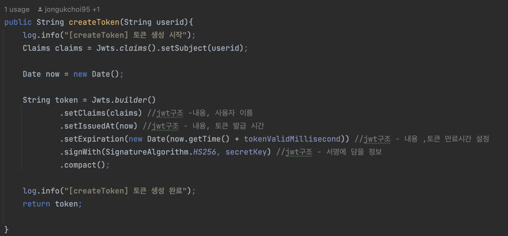


<br/>
<br/>
<br/>
<br/>

## 컨벤션 ➰

### Coding Convention

> **GIT Branch Convention**
>

| master | - 배포 가능한 상태의 결과물 |
| --- | --- |
| develop | - 구현할 기능을 병합하기 위한 브랜치, 통합 폴더의 기능 |
| release | - 개발된 내용을 배포하기 위해 준비하는 브랜치, 버그 수정 내용을 develop 브랜치에도 반영하고, 최종적으로 master 브랜치에 머지 |
| feature | - 개발 기능 구현 브랜치, 기능 개발 완료 시 삭제 |
| hotfix | - 수정 |

<br/>

> **GIT Commit Convention**
> 

**ex) FEAT: 로그인 rest api 추가**

| FEAT | 새로운 기능을 추가할 경우 |
| --- | --- |
| FIX | 버그를 고친 경우 |
| STYLE | 코드 포맷 변경, 간단한 수정, 코드 변경이 없는 경우 |
| REFACTOR | 프로덕션 코드 리팩토링 |
| DOCS | 문서를 수정한 경우 |
| RENAME | 파일 혹은 폴더명 수정 및 이동 |
| REMOVE | 파일 삭제 |
| CHORE | build task 수정, 프로젝트 매니저 설정 수정 등 |

<br/>

> **JIRA Convention**
> 

- **에픽**
    - 큰 단위의 업무(여러 User Story, Task 등을 묶은 단위)
    - **생성 Convention**
        - Epic을 생성할 때 파트를 적어준다.
        - ex) BE 개발, FE 개발
- **스토리**
    - 해당 Epic의 하위 단위 작업으로 직접적인 개발과 기능 구현을 기본으로 한다.
    - User Story의 크기는 sprint내에 완료 가능한 단위로 분할 필요
    - **생성 Convention**
        - ex) 로그인 기능
            - 로그인 기능 개발
            - UI/UX 구현
            - 합의 알고리즘 구현
- **부작업**
    - Story, Task를 더 작은 단위로 나눈 업무
    - **생성 Convention**
        - 작업을 직관적으로 알 수 있도록 작성
        - ex) 자동 로그인 기능 구현
- **작업**

<br/>
<br/>
<br/>
<br/>

## 프로젝트 결과물
- [포팅메뉴얼](https://lab.ssafy.com/s08-bigdata-recom-sub2/S08P22C104/-/blob/develop/exec/%ED%8A%B9%ED%99%94PJT_%EA%B4%91%EC%A3%BC_1%EB%B0%98_C104_%ED%8F%AC%ED%8C%85%EB%A7%A4%EB%89%B4%EC%96%BC.docx)
- [중간발표자료](https://lab.ssafy.com/s08-bigdata-recom-sub2/S08P22C104/-/blob/develop/ppt/%EB%B6%81%EB%8F%8B%EC%9B%80_%EC%A4%91%EA%B0%84%EB%B0%9C%ED%91%9C.pdf)
- [최종발표자료](https://lab.ssafy.com/s08-bigdata-recom-sub2/S08P22C104/-/blob/develop/ppt/%EB%B6%81%EB%8F%8B%EC%9B%80_%EC%B5%9C%EC%A2%85%EB%B0%9C%ED%91%9C.pdf)


<br/>
<br/>
<br/>

## 팀원 소개

|        |    |        |          |          |        |
| :--------------------------------------------: | :-----------------------------------------: | :--------------------------------------------: | :-------------------------------------------------: | :----------------------------------------------: | :----------------------------------------------: |
| **[FE 최지우👑](https://github.com/choizlor)** | **[FE 김유나](https://yunae.tistory.com/)** | **[FE 나혜승](https://github.com/HyeseungNA)** | **[BE 최종욱](https://whitedevelper.tistory.com/)** | **[BE 이원석](https://github.com/wonseokLee97)** | **[AI 이창민](https://changmiin2.tistory.com/)** |

<br/>
<br/>

---
